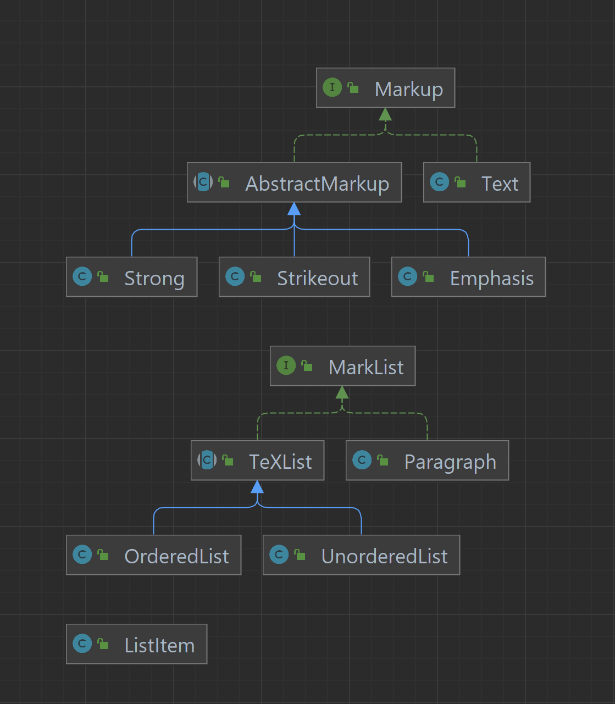

# Конвертер из Markdown-разметки в HTML
## Пакет markup
В этом пакете находятся классы для текстовой разметки. Дерево зависимостей:

## Пакет md2html
Пакет состоит из [одного класса](src/md2html/Md2Html.java), чей метод main принимает в качестве аргументов 
командной строки название входного Markdown файла и название выходного файла, и записывает в выходной файл 
полученную из входных данных HTML разметку.